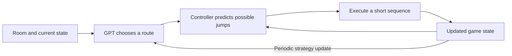

# Drilly P backend

`drilly.ts` exposes authenticated room-building and raid actions. Guest startup
opens a fresh game; it does not load or save drafts. Both hosted play and the optional Vite development
endpoint use the same modules under `server/drilly/`:

Hosted AI actions use Convex's Node runtime because the OpenAI SDK requires URL
operations that the default Convex runtime does not implement.

| Module                                      | Responsibility                                                       |
| ------------------------------------------- | -------------------------------------------------------------------- |
| `build.ts`                                  | Edit/test loop, route checkpoint, best proven challenge, publication |
| `buildBrief.ts`                             | Player-history brief and spatial/hazard inspiration                  |
| `construction.ts`                           | Empty workspace and immutable object edits                           |
| `buildSchema.ts`                            | Structured editing tool format                                       |
| `planner.ts`                                | Scored attempt budget and failure feedback                           |
| `attempt.ts`                                | LLM route decisions and the forward-only attempt                     |
| `movement.ts`                               | Bounded physics lookahead and executed jump prefixes                 |
| `observation.ts`                            | Current geometry, hazards and player state                           |
| `proof.ts`                                  | Builder practice using the same controller and timing feedback       |
| `variety.ts`                                | Structural comparison, used as quality feedback                      |
| `protocol.ts`, `provider.ts`, `deadline.ts` | Model contract, OpenAI SDK and cancellation                          |

Gameplay validation stays in `shared/validation.ts`; Convex wire validators live
in `convex/lib/validators.ts`. Simulation and tuning stay in `shared/game/`.
There are no per-tick database writes or new persistence tables for AI play.

## Configuration

Use the existing development deployment. Set `OPENAI_API_KEY` in its backend
environment. Drilly defaults to `gpt-6-astra`; `DRILLY_MODEL` is an optional override.
Both variables are optional declarations in `convex.config.ts`; a missing key
disables live AI with a clear error. Never put the key in `VITE_`
variables, browser code or Git. `VITE_CONVEX_URL` connects the guest frontend.

The adapter uses the official OpenAI TypeScript SDK's Responses API with strict
structured output, bounded output size, `store: false`, and explicit low reasoning
effort. It forwards the requested effort without inferring capabilities from model
names. SDK retries are disabled with `maxRetries: 0`; SDK logging is disabled so
provider bodies stay out of game logs. Per-call timeouts and overall request
deadlines abort outstanding HTTP requests. Limits are in shared rules;
they are per request, not account-wide spending controls. Controller changes do
not change physics or replay compatibility.

## Building and playing



The LLM edits geometry and chooses a route; the movement controller calculates
jump timing through short, receding-horizon simulations. Only the selected prefix
becomes real input. The attempt never rewinds. Human and AI share movement and
collision rules. Full-room search and the human's clear recording are unavailable
to the raid controller. Model-call exhaustion continues the current route until
the ordinary simulation limit. Provider failures remain technical errors, not
medal-bearing losses.

These loops run in simulated game time on the backend. The browser plays the
resulting recording. Short physics predictions are calculations within an attempt,
so the scored attempt limit does not limit their number. Exact state access and
physics prediction give Drilly an advantage; human difficulty balance still needs
playtesting. Learning means supplying recent results as context to the model;
the app does not train or update model weights.

The builder first establishes a playable route, which may still be ordinary
running. It then adds a hazard or another intentional jumping challenge. Failed
edits preserve the last cleared route for repair and the best meaningful challenge
for publication. Novelty and timing margins rank improvements rather than vetoing
whole rooms. A later provider failure can return the proven challenge; a plain
floor or an uncompleted room can never be presented as a successful build.

The build response is `{ level, proof }`, where `proof` is an actual winning replay
of exactly that level. The browser validates and replays it before starting the
raid. `src/game/session.ts` starts one preparation while the human edits and reuses
it on submission. The proof can be watched after the human raid, without spending
attempts or awarding medals. Abandoned-round results cannot advance the session.

Learning summaries remain in the game session and reset on reload. Draft saving,
restoration and revision-conflict handling are outside the current hackathon scope.

Build logs contain edit-stage outcomes; raid logs contain actual attempt outcomes
and brief route objectives. They exclude API keys, user identities, full prompts
and input recordings. Detailed traces belong in explicit local evaluation reports.

## Verification

Run `npm test`, `npm run lint`, and `npm run build`. Tests cover deterministic
movement across varied known-solvable layouts, all obstacle kinds, actual build
proofs, checkpoint recovery, authentication, external-data validation, stale
requests, background preparation and proof playback without scoring. Ordinary
tests never call a paid provider.

Run an explicit live evaluation against the configured development model:

```sh
npm run eval:drilly -- --live --deployment YOUR_DEV_DEPLOYMENT --cases saws,wall,spikes,slider,prison,build --report /tmp/drilly-eval.json
```

Repeat `build` in the case list to test successive rooms with recent-room history.
`--history-report /tmp/previous-drilly-eval.json` seeds prior delivered rooms.
`--player-profile confident` or `--player-profile struggling` supplies clearly
simulated human history for adaptation checks. The default is a new player.
Omit `--deployment` to use server process environment variables.

The command exits unsuccessfully for a failed build, invalid replay, or raid with
no clear. It reports calls and elapsed time; detailed decisions and recordings go
to the specified file outside Git. Evaluate geometry and variety as well as success:
a small passing sample does not establish a production reliability guarantee or
human enjoyment. See [game design](../docs/game-design.md) for the accepted behavior
and architecture references.
